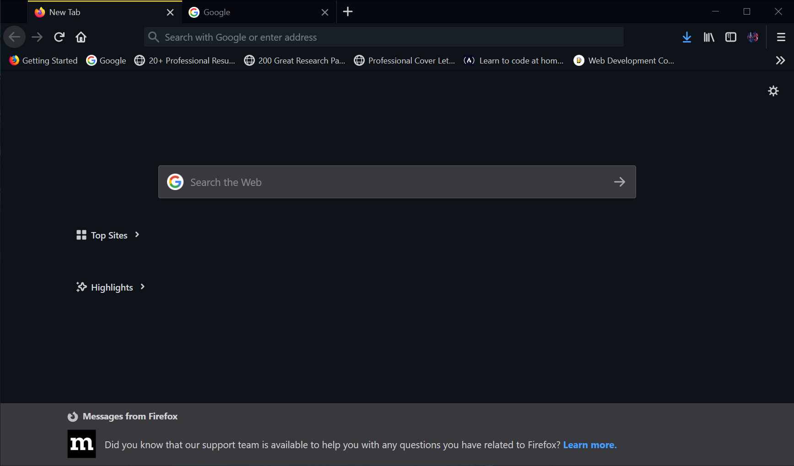
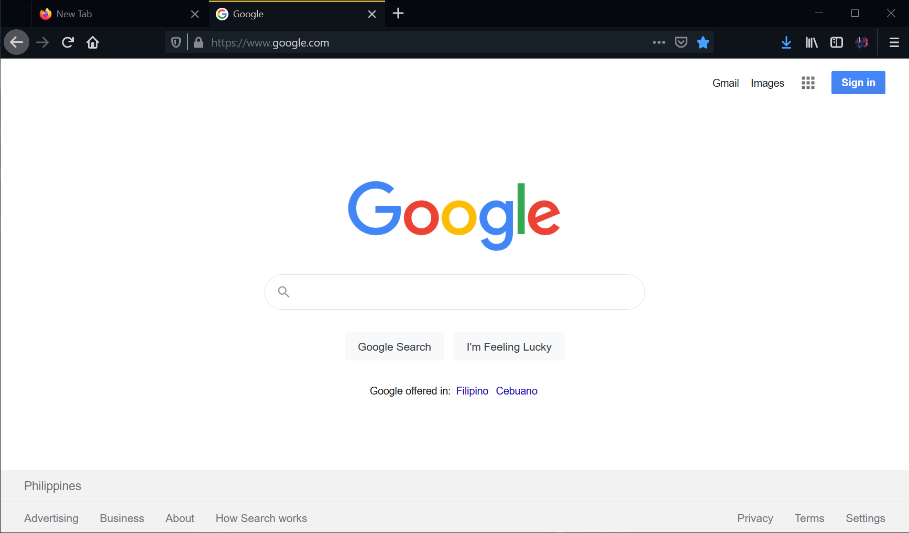
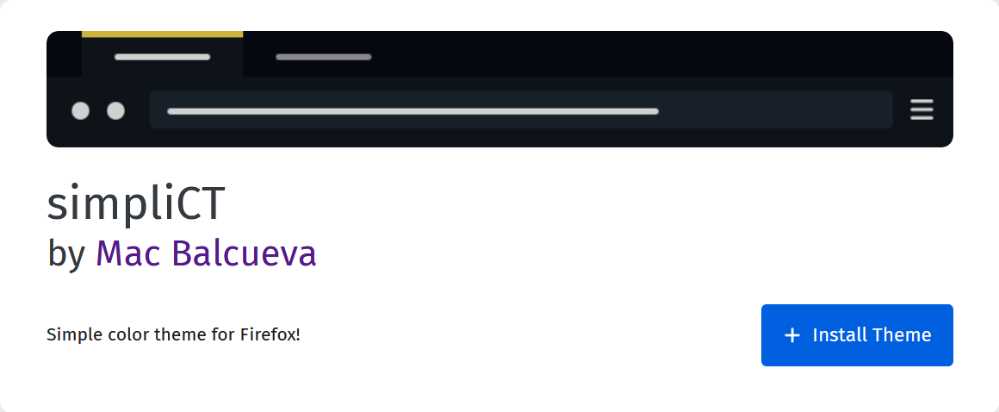

# simpliCT

A simple color theme for firefox.

## Preview

## Installation

* Open your [Firefox](https://www.mozilla.org/en-US/firefox/new/)  web browser and head over to https://addons.mozilla.org/en-US/firefox/addon/simplict/

* Click install theme
  
  

* Enjoy!

# Version History
  * 2.0
    * Bug fixes and added new colors
  * 1.0
    * Initial release

# License

This work is licensed under a [Creative Commons Attribution 3.0 Unported License](https://creativecommons.org/licenses/by/3.0/). See [LICENSE.txt](LICENSE.txt) for details.